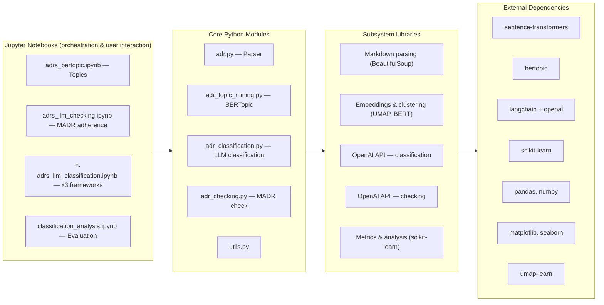

# Architecture

Overview of ADRMiner's modular design and component relationships.

> **Note on code location.** The canonical, runnable implementation lives under `notebooks/` (Jupyter notebooks plus the `.py` modules they import). The `src/` directory holds an in-progress package refactor and currently contains no source files; do not rely on it to run the workflow.

---

## High-Level Architecture



---

## Module Breakdown

### 1. `adr.py` – ADR Parser

**Purpose**: Parse markdown ADR documents into structured components

**Key Classes**:
```python
class adr:
    # Core attributes
    - name: str (filename)
    - properties: dict (metadata key:value pairs)
    - titles: defaultdict (heading levels)
    - hierarchy: defaultdict (nested section structure)
    - content_raw: defaultdict (paragraphs by section)
    - content_code: defaultdict (code blocks by section)
    - full_raw_content: str (original markdown)
    
    # Key methods
    - get_title() → str
    - get_content(title) → list[str]
    - get_content_no_code_str(title) → str
    - get_decision() → str (extracts decision section)
    - get_hierarchy() → dict
    - get_properties(key) → dict | str
    - get_code(title) → list | dict
    - get_full_content() → str (reconstructed)
```

**Parsing Logic**:
1. Convert markdown to HTML (via markdown library)
2. Parse HTML with BeautifulSoup
3. Walk document tree, extracting:
   - Headings (h1-h4) → hierarchy
   - Paragraphs → content_raw
   - Code blocks → content_code
   - Key:value pairs → properties
4. Reconstruct hierarchy in path format: `'h1 #@# h2 #@# h3'`

**Complexity**: ~350 lines of state machine logic
- Handles nested structures, code block detection, YAML-like properties
- Tolerates malformed markdown gracefully

---

### 2. `adr_topic_mining.py` – Topic Modeling

**Purpose**: Discover topics in ADR corpus using BERTopic

**Key Classes**:
```python
class ADRTopicModel:
    # State
    - corpus: list[str] (cleaned ADR texts)
    - embeddings: np.ndarray (sentence embeddings)
    - topic_model: BERTopic (fitted model)
    - topics_df: pd.DataFrame (topic info)
    - representation_model: dict (KeyBERT + OpenAI)
    
    # Key methods
    - prepare_corpus(docs) → None
    - build(n_topics, use_openai) → pd.DataFrame
    - load(folder) → pd.DataFrame
    - persist(folder) → None
    - predict(adr_text, multiple_topics) → Dict
    - predict_batch(adr_texts) → List[Dict]
    - get_topk_topics(k) → pd.DataFrame
    - compute_topic_coherence() → float
    - compute_topic_diversity() → float
```

**Pipeline**:

```
Raw ADR Texts
    ↓
[Preprocessing]
- Prune corpus (remove empty, very short)
- Normalize whitespace
    ↓
[Embedding]
- Sentence-Transformers (all-MiniLM-L6-v2)
- Output: 384-dim vectors
    ↓
[Dimensionality Reduction]
- UMAP (5 dimensions for clustering)
- Config: n_neighbors=15, min_dist=0.0, cosine metric
    ↓
[Topic Clustering]
- BERTopic with auto-topic detection
- Tuning: Tries 10-100 topics, picks best
    ↓
[Representation]
- Primary: KeyBERT (lexical relevance)
- Secondary (optional): OpenAI GPT-4 labels
    ↓
Topics DataFrame
```

**Output Format**:
```json
{
  "topic": -1,  // Topic ID (-1 = outlier/noise)
  "count": 45,  // Documents assigned
  "main": "api design decisions",  // KeyBERT label
  "openai": "REST API Architecture" // Optional
}
```

**Configuration**:
| Parameter | Default | Purpose |
|-----------|---------|---------|
| `language` | 'english' | Stop words for vectorizer |
| `embedding_model` | 'all-MiniLM-L6-v2' | Sentence transformer |
| `metric` | 'cosine' | Distance metric for UMAP |
| `use_openai` | False | GPT-4 labeling (costs $) |

---

### 3. `adr_checking.py` – ADR Checking / MADR Adherence

**Purpose**: Assess whether each ADR adheres to the [MADR](https://adr.github.io/madr/) template — both an overall adherence assessment and a fine-grained, per-section consistency analysis.

**Key Class**:
```python
class ADRChecker:
    # State
    - llm: ChatOpenAI (LLM instance)
    - pydantic parser for structured outputs

    # Key methods
    - check_madr_adherence(adr_text, metadata=None) → Dict
        # Overall adherence assessment: template_match, purpose_match,
        # problems, adherence_score, suggestions, ...
    - check_sections(adr_text, metadata=None) → Dict
        # Per-section consistency analysis across the 5 MADR sections:
        # Context, Decision, Consequences, Decision Drivers, Considered Options
        # For each: presence, content score, purpose-consistency, issues
    - check(adr_text, metadata=None) → Dict
        # Combined: runs both assessments and merges results
    - check_batch(adr_texts_dict, organization, project,
                  parallel=True, json_file=None) → List[Dict]
```

**Pydantic result models** (structured LLM output):
- `ADRTemplate` — overall template/adherence assessment
- `ADRConsistecySections` / `ADRConsistencyResult` — per-section consistency
- `ADRAlternative`, `ADRAssessmentReport` — supporting fields

**Prompts** (in `prompts.py`):
- `FULL_CONSISTENCY_OVER_EXTRACTED_ADR` — global adherence assessment
- `CONSISTENCY_PROMPT_ALL_SECTIONS` — all-sections consistency
- `CONSISTENCY_PROMPT_BY_SECTION` — per-section consistency
- `get_adr_sections_metadata()` — helper to derive section structure

**Assessed MADR Sections**:
| Section | Assessed aspects |
|---------|------------------|
| Context | Presence, content quality, purpose consistency |
| Decision | Presence, content quality, purpose consistency |
| Consequences | Presence, content quality, purpose consistency |
| Decision Drivers | Presence, content quality, purpose consistency |
| Considered Options | Presence, content quality, purpose consistency |

**Output Format** (combined `check()`):
```json
{
  "metadata": {"organization": "...", "project": "..."},
  "template": { "template_match": true, "adherence_score": 0.85, ... },
  "sections": {
     "Context":            { "present": true, "content_score": 0.9, ... },
     "Decision":           { "present": true, "content_score": 0.8, ... },
     "Consequences":       { "present": false, ... },
     "Decision Drivers":   { "present": true, ... },
     "Considered Options": { "present": false, ... }
  }
}
```

**Notebook**: `notebooks/adrs_llm_checking.ipynb` drives this stage. Batch runs
are persisted as `results/all_projects-checks_results*.json`.

---

### 4. `adr_classification.py` – LLM Classification

**Purpose**: Classify ADRs using language models

**Key Classes**:
```python
class ADRClassifier:
    # State
    - llm: ChatOpenAI (LLM instance)
    - classification_prompt: ChatPromptTemplate
    - qa_chain: LangChain chain (prompt → LLM → parser)
    - framework: ClassificationFramework (enum)
    
    # Key methods
    - set_framework(framework, include_examples, examples) → None
    - classify(adr_text, as_dict) → Dict
    - classify_batch(adr_texts, parallel) → List[Dict]
    - evaluate_on_ground_truth(gt_df, llm_results) → Dict
    - predict_and_evaluate_on_ground_truth(gt_df) → Dict
    
    # Static utilities
    - _num_tokens_from_adr(string) → int
    - compute_kappa_per_class(y_true, y_pred) → dict
    - count_similarities(y_true, y_pred) → float
    - find_differences(y_true, y_pred) → list
```

**Classification Frameworks** (enums):

1. **KruchtenEnum**: Existence, Ban, Property, Executive
2. **QualityAttributesEnum**: 10 quality attributes + Other
3. **ZimmermannEnum**: 9 decision types + Other

**Prompting Strategy**:

```
System: "You are a software architecture expert..."

Few-shot Examples (optional):
- Example 1: ADR → Classification + Explanation + Confidence
- Example 2: ADR → Classification + Explanation + Confidence
- Example N: ...

User Input: [ADR Text]

Expected Output (JSON):
{
  "framework": "quality_attributes",
  "primary_category": "Performance",
  "explanation": "...",
  "primary_score": 0.92,
  "alternative_categories": ["Scalability", "Reliability"],
  "alternative_confidence_scores": [0.05, 0.03]
}
```

**Few-shot Strategies**:

1. **Zero-shot**: No examples
   ```python
   classifier.set_framework(fw, include_examples=False)
   ```

2. **Static few-shot**: Predefined examples (5-7)
   ```python
   classifier.set_framework(fw, include_examples=True)
   ```

3. **Dynamic few-shot**: Semantic similarity selection
   ```python
   classifier.set_framework(fw, include_examples=True, 
                           examples=gt_samples, k=5)
   ```

**LangChain Chain**:

```
PromptTemplate (with examples/placeholders)
    ↓
ChatOpenAI(model="gpt-4o-mini", temperature=0.0)
    ↓
PydanticOutputParser (extracts structured JSON)
    ↓
Classification Result Object
```

**Batch Processing**:
- Sequential: Safe, slow (~60 sec per ADR)
- Parallel: Fast, uses ThreadPoolExecutor, respects API rate limits

---

### 5. `utils.py` – Utilities & Helpers

**Purpose**: Data processing, visualization, document extraction

**Key Functions**:

| Function | Purpose |
|----------|---------|
| `get_documents(org_projects, adrs_dict, field)` | Extract texts from ADRs |
| `get_documents_by_key((org, project), adrs_dict, field)` | Extract texts for a single org/project |
| `process_projects(dict_adrs, min_adrs, min_length)` | Filter small projects |
| `prune_corpus(dict_adrs)` | Clean and deduplicate |
| `extract_gt_summary(gt_df)` | Ground truth statistics |

**Field Options**:
- `'title'`: Document title only
- `'content'`: Text without code blocks
- `'both'`: Title + content
- `'raw'`: Original markdown
- `'decision'`: Decision section

---

### 6. Supporting Modules

**`prompts.py`**:
- Classification prompt templates for each framework (zero-shot and few-shot variants)
- ADR-checking prompts: `FULL_CONSISTENCY_OVER_EXTRACTED_ADR`,
  `CONSISTENCY_PROMPT_ALL_SECTIONS`, `CONSISTENCY_PROMPT_BY_SECTION`
- Instruction engineering for LLM consistency

**`custom_selector.py`**:
- Few-shot example selection logic
- Semantic similarity search (max-marginal-relevance)
- Dynamic prompt building

---

## Data Flow

### Topic Modeling Flow

```
INPUT: ADR Dataset
  (pickle of org/project -> ADR raw text, or org/project/adr-*.md files)
    ↓
[ADR Parser] (adr.py)
  Extract: titles, content, hierarchy
    ↓
[Corpus Preparation] (utils.py)
  Clean texts, filter short docs
    ↓
[Embedding] (sentence-transformers)
  Convert to vectors: 384-dim
    ↓
[UMAP Reduction] (umap)
  Reduce to 5-dim: clustering prep
    ↓
[BERTopic Clustering]
  Group similar docs → topics
    ↓
[Representation Generation]
  KeyBERT: lexical ranking
  OpenAI: semantic labeling (opt)
    ↓
OUTPUT: Topic Model
  - Saved as BERTopic folder (notebooks/saved_topicmodel/)
  - Topics DataFrame (CSV/pickle)
  - Corpus JSON
```

### ADR Checking Flow

```
INPUT: ADR Text (raw markdown)
    ↓
[Prompt Construction] (prompts.py)
  - Global adherence prompt (FULL_CONSISTENCY_OVER_EXTRACTED_ADR)
  - Section-consistency prompt (CONSISTENCY_PROMPT_ALL_SECTIONS /
    CONSISTENCY_PROMPT_BY_SECTION)
    ↓
[LLM Calls] (adr_checking.py via ChatOpenAI)
  - Overall adherence assessment
  - Per-section presence/quality/consistency
    ↓
[Pydantic Parsing]
  ADRTemplate, ADRConsistencyResult, ADRConsistecySections
    ↓
OUTPUT: Checking Result
  {
    template: adherence_score, template_match, problems, suggestions
    sections: { Context, Decision, Consequences,
                Decision Drivers, Considered Options }
  }
  → results/all_projects-checks_results*.json
```

### Classification Flow

```
INPUT: ADR Texts + Framework
    ↓
[Prompt Construction]
  - Select framework template
  - Add examples (if enabled)
  - Embed user ADR in prompt
    ↓
[LLM Call]
  GPT-4o-mini:
  - Process tokens
  - Generate JSON response
    ↓
[Output Parsing]
  Pydantic model validation
  Extract structured result
    ↓
[Fallback Handling]
  If Jinja2 error → retry with f-string
    ↓
OUTPUT: Classification Result
  {
    framework, primary_category,
    explanation, scores, alternatives
  }
```

### Evaluation Flow

```
INPUT: Ground Truth Labels + LLM Predictions
    ↓
[Alignment]
  Match predictions to GT by ADR key
    ↓
[Encoding]
  Convert category strings → integers
    ↓
[Metrics Computation]
  - Classification report (sklearn)
  - Confusion matrix
  - Matthews correlation
    ↓
[Difference Analysis]
  Find misclassified examples
  Rank by frequency
    ↓
OUTPUT: Evaluation Report
  {
    report, confusion_matrix, kappa,
    matthews, similarities, differences
  }
```

---

## Dependencies

### Core Libraries

| Package | Purpose | Version |
|---------|---------|---------|
| `bertopic` | Topic modeling | 0.17.0 |
| `sentence-transformers` | Embeddings | 4.0.2 |
| `langchain-openai` | LLM integration | - |
| `scikit-learn` | Metrics & preprocessing | 1.6.1 |
| `umap-learn` | Dimensionality reduction | - |
| `pandas` | Data processing | 2.2.3 |
| `numpy` | Numerical computing | 1.26.4 |
| `beautifulsoup4` | HTML parsing | 4.13.3 |
| `markdown` | Markdown → HTML | 3.8 |
| `openai` | OpenAI API client | 1.82.0 |
| `matplotlib` | Visualization | 3.10.1 |
| `seaborn` | Statistical plots | 0.13.2 |

See `requirements.txt` for complete list.


---

## Configuration

### Environment Variables (`.env`)

```env
OPENAI_API_KEY=sk-...                    # Required for LLM
OPENAI_MODEL_NAME=gpt-4o-mini            # Model choice
```

### Notebook Parameters

Key tuning parameters in notebooks:

```python
# Topic Modeling
n_topics = 50                    # Number of topics
use_openai = True               # GPT-4 labeling
embedding_model = 'all-MiniLM-L6-v2'

# Checking
# (uses the same llm/temperature as classification)

# Classification
temperature = 0.0               # LLM determinism
include_examples = True         # Few-shot
parallel = True                 # Batch processing

# Evaluation
min_adrs_per_project = 5       # Filtering
min_adr_length = 500           # Minimum doc length
```

---

## Extensibility Points

### Adding a New Classification Framework

1. Define new Enum in `adr_classification.py`:
   ```python
   class NewFrameworkEnum(str, Enum):
       CATEGORY_A = "Category A"
       CATEGORY_B = "Category B"
   ```

2. Create Pydantic result class:
   ```python
   class NewFrameworkResult(BaseModel):
       framework: Literal["new_framework"] = "new_framework"
       primary_category: NewFrameworkEnum
       # ... fields
   ```

3. Add prompt template in `prompts.py`

4. Register in `_configure_chain()`:
   ```python
   elif framework == "new_framework":
       return prompt | llm.with_structured_output(NewFrameworkResult)
   ```

### Adding New MADR Sections to Checking

1. Update the section list used by `ADRChecker.check_sections()`.
2. Adjust `CONSISTENCY_PROMPT_ALL_SECTIONS` / `CONSISTENCY_PROMPT_BY_SECTION`
   in `prompts.py`.
3. Extend the relevant Pydantic models in `adr_checking.py`.

### Using Alternative Topic Models

Replace BERTopic in `adr_topic_mining.py`:
```python
# Current: BERTopic
# Alternative: LDA, TopicMaster, Latent Semantic Analysis (LSA)

from sklearn.decomposition import LatentDirichletAllocation

# Build LDA instead of BERTopic
lda = LatentDirichletAllocation(n_components=50)
topics = lda.fit_transform(tfidf_matrix)
```

### Using Different LLM Providers

Replace OpenAI in `adr_classification.py` (or `adr_checking.py`):
```python
from langchain_anthropic import ChatAnthropic
# or
from langchain_google_genai import ChatGoogleGenerativeAI

llm = ChatAnthropic(model="claude-3-sonnet")
classifier = ADRClassifier(llm)
checker = ADRChecker(llm)
```

---

### Optimization Tips
- Use `parallel=True` for batch LLM calls (classification and checking)
- Pre-compute embeddings, save, reload for iterations
- Filter corpus before modeling (min length, max length)

### Unit Testing
- Parse ADRs: Verify title, content extraction
- Topic model: Check topic count, coherence > 0.6
- Checking: Verify JSON output structure (template + sections)
- Classification: Verify JSON output structure
- Metrics: Compare against known baselines

### Quality Checks
- Corpus: No empty texts, minimum length
- Embeddings: No NaN values
- Topics: Coherence > 0.6, diversity > 0.5
- Classifications: All scores sum to 1.0
- Checks: adherence_score in [0,1], sections fully covered

---

**See [Usage](USAGE.md) for API reference and examples.**